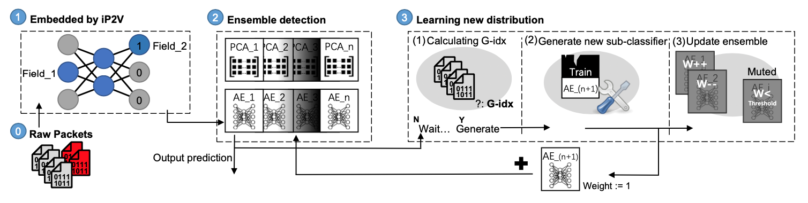

**ENIDrift**

[![Discord Chat][discord-badge]][discord]
==

**ENIDrift** is a fast and adaptive **E**nsemble system for **N**etwork **I**ntrusion **D**etection under real world **Drift**. In this repo, we provide the artifact of ENIDrift (ACSAC'22).

## What is ENIDrift?
Machine Learning (ML) techniques have been widely applied for network intrusion detection. However, existing ML-based network intrusion detection systems (NIDS) suffer from fundamental limitations that hinder them from being deployed in the real world. They consider a narrow scope rather than real-world drift that involves dynamically distributed network packets and well-crafted ML attacks. Besides, they pose high runtime overhead and have low processing speed.

In this work, we solve the limitations and design ENIDrift, a fast and adaptive ensemble system for real-world network intrusion detection. ENIDrift employs iP2V, a novel incremental feature extraction method based on network packet fields, which adopts a simple three-layer neural network with relatively lightweight computation and achieves high efficiency. ENIDrift uses a robust sub-classifier generation module that constructs new sub-classifiers based on the stability and accuracy of incoming data chunks, and its training time is also reduced from O(n) to O(1).



We show the workflow of ENIDrift in the above figure. At the initial stage, raw packets will be captured by external programs (e.g., WireShark). Then the data will be sent to our system continuously. The later three parts in the figure are where the main body of ENIDrift lies:
* **iP2V embedding.** ENIDrift provides an incremental packet-to-vector tool, iP2V, deployed to extract features from raw network packets. The extraction results will be sent for the following ensemble detection.
* **Ensemble detection.** The ensemble model of ENIDrift consists of several sub-classifiers and ENIDrift will output the weighted predictions as its final detection result. Meanwhile, the incoming data will also be copied to sub-classifier generation module for further training.
* **Learning new distribution.** Sub-classifier generation module and ENIDrift update module involve in the stage. They will help find the right training data chunk based on our G-idx and adjust the ensemble model.

Compared to other work, ENIDrift has:
1. **Novel techniques and system.** We develop a new NIDS, ENIDrift with several new techniques: 1) iP2V that incrementally embeds relevant network packets into similar vectors and has good performance and efficiency for NIDS tasks; 2) G-idx that measures both stability and accuracy of current data chunk for a more robust sub-classifier generation; 3) ENIDrift update module that improves the adjustment of sub-classifier weights and data chunk management.
2. **New dataset with real-world drift.** We spent considerable effort constructing a new dataset considering real-world settings and fierce drift caused by concept drift, imbalanced data, and well-crafted ML attack.
3. **Readily deployable performance.** Our evaluation results demonstrate that ENIDrift has good performance on both accuracy and processing speed, and is sufficient for real-world deployment even under inadequate and delayed training data.

## Prerequisites
1. Pre-process for network packets.

      For privacy issues, only key network fields are kept in our dataset in the form of .csv files. Accordingly, the input for ENIDrift is .csv files containing the string-type fields of network packets. If you want to run on your own .pcap file, we suggest utilizing our [python script](https://github.com/AnonymousGithubRepo/ENIDrift/blob/main/util/pcap2csv.py) to convert .pcap to .csv file first. The script is based on [Kitsune](https://github.com/ymirsky/Kitsune-py).

2. Software configuration:
      * Python 3.8.5
      * scikit-learn 0.23.2
      * tensorflow 2.4.1
      * scapy 2.4.3
      * scipy 1.7.1
      * joblib 1.1.0
## Quick start
1. Download the source code:
```sh
$ git clone https://github.com/X1anWang/ENIDrift
```

2. Run ENIDrift:
```sh
$ cd ENIDrift
$ python3 main
```

## Examples

Please see the ACSAC'22 artifact evaluation [repository](https://github.com/X1anWang/ENIDrift-Artifact) for detailed instructions and possible errors for running ENIDrift.

## Advanced functions
1. Model save.
      To save the artificial neural network of iP2V and sub-classifiers of ENIDrift (i.e., models, weights and number of trained sub-classifiers), please set the 'save' option to be True in the main.py file. The program will save the related information by joblib library at the end of the execution. The ENIDrift sub-classifiers will be saved in the folder named model. The neural network of iP2V will be saved in the folder named para (short for parameter).

2. Model load.
      If there are files with corresponding types in the folder of model and para, the program will detect them and load the weights and parameters into ENIDrift.

3. Control the speed of the release of training data.
      To simulate the time gap and delay of training data with ground truth labels, we enables a much slower release of training data. To observe NIDS under different levels of delays, please set the parameter 'realese_speed' with corresponding values.

# Real-world Drift Dataset for Network Intrusion Detection

We spent considerable effort constructing a new dataset considering real-world settings and fierce drift caused by concept drift, imbalanced data, and well-crafted ML attack. It consists of two part: 1) common network packets provided by categories, and 2) fierce real world drift.

Part I: The common network packets consist of port scan and dos attack, and are provided by normal and anomalous types. Its level of drift is gentle. Users are expected to combine the data according to their need for the drift level. A simple way is to combine them according to their timestamp, and mix network packets from different days to increase the drift level. It is provided [here](https://drive.google.com/drive/folders/11Trsu4zsKJo8CBbv52j_N6BEPjcJkItu?usp=sharing).

Part II: To evaluate the three components of ENIDrift, we summarize four sub-set for the main channels of real-world drift for NIDS: adversarial attack, data contamination, heavy drift and reocurrent attack. This part is provided by the four sub-set and can be used directly according to our script. It is provided [here](https://drive.google.com/drive/folders/1JTaDNCpZXSIUDiKXKc_AUxDEg4IGQaL6?usp=sharing).

# License
This project is licensed under the MIT License - see the [LICENSE](https://github.com/x1anwang/ENIDrift/blob/main/LICENSE) file for details

## Documentation
Please download the paper for details on ENIDrift concepts and configuration.

## Community & help
* If you see an error message or run into an issue, please make sure to create a [bug report](https://github.com/x1anwang/enidrift/issues).
* Email are also welcome: Sean, xwanggj@connect.hku.hk
<!-- refs -->
[license-badge]: https://img.shields.io/github/license/x1anwang/enidrift